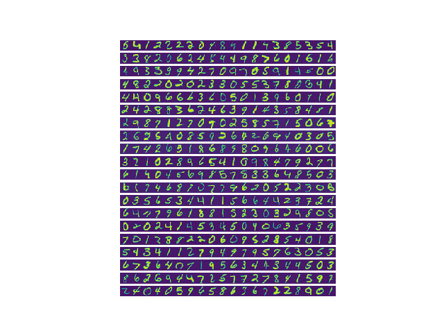

# Multi-сlass Classification

In this exercise, you will implement one-vs-all logistic regression and neural
networks to recognize hand-written digits
For this exercise, you will use logistic regression and neural networks to
recognize handwritten digits (from 0 to 9). Automated handwritten digit
recognition is widely used today - from recognizing zip codes (postal codes)
on mail envelopes to recognizing amounts written on bank checks. This
exercise will show you how the methods you’ve learned can be used for this
classification task.
In the first part of the exercise, you will extend your previous implemention of logistic regression and apply it to one-vs-all classificatio

## Dataset

You are given a data set in ex3data1.mat that contains 5000 training examples of handwritten digits.2 The .mat format means that that the data has
been saved in a native Octave/MATLAB matrix format, instead of a text
(ASCII) format like a csv-file. These matrices can be read directly into your
program by using the load command. After loading, matrices of the correct
dimensions and values will appear in your program’s memory. The matrix
will already be named, so you do not need to assign names to them.

There are 5000 training examples in ex3data1.mat, where each training
example is a 20 pixel by 20 pixel grayscale image of the digit. Each pixel is
represented by a floating point number indicating the grayscale intensity at
that location. The 20 by 20 grid of pixels is \unrolled" into a 400-dimensional
vector. Each of these training examples becomes a single row in our data
matrix X. This gives us a 5000 by 400 matrix X where every row is a training
example for a handwritten digit image.

The second part of the training set is a 5000-dimensional vector y that
contains labels for the training set. To make things more compatible with
Octave/MATLAB indexing, where there is no zero index, we have mapped
the digit zero to the value ten. Therefore, a \0" digit is labeled as \10", while
the digits \1" to \9" are labeled as \1" to \9" in their natural order.

## Visualizing the data

You will begin by visualizing a subset of the training set. In Part 1,
the code randomly selects selects 100 rows from X and passes those rows
to the displayData function. This function maps each row to a 20 pixel by
20 pixel grayscale image and displays the images together.

## Vectorizing Logistic Regression

You will be using multiple one-vs-all logistic regression models to build a
multi-class classifier. Since there are 10 classes, you will need to train 10
separate logistic regression classifiers. To make this training efficient, it is
important to ensure that your code is well vectorized. In this section, you
will implement a vectorized version of logistic regression that does not employ
any for loops. You can use your code in the last exercise as a starting point
for this exercise.

## Vectorizing the cost function

We will begin by writing a vectorized version of the cost function. Recall
that in (unregularized) logistic regression, the cost function is

sigmoid function. It turns out that we can compute this quickly for all our
examples by using matrix multiplication. Let us define X and θ as

Your job is to write the unregularized cost method lrCostFunction()
Your implementation should use the strategy we presented above to calculate θT x(i). You should also use a vectorized approach for the rest of the
cost function. A fully vectorized version of lrCostFunction.m should not
contain any loops.
(Hint: You might want to use the element-wise multiplication operation
(.*) and the sum operation sum when writing this function)

##  Vectorizing the gradient

The expression above allows us to compute all the partial derivatives
without any loops. If you are comfortable with linear algebra, we encourage
you to work through the matrix multiplications above to convince yourself
that the vectorized version does the same computations. You should now
implement Equation 1 to compute the correct vectorized gradient. Once you
are done, complete the method lrCostFunction() by implementing the
gradient.

Debugging Tip: Vectorizing code can sometimes be tricky. One common strategy for debugging is to print out the sizes of the matrices you
are working with using the size function. For example, given a data matrix X of size 100 × 20 (100 examples, 20 features) and θ, a vector with
dimensions 20×1, you can observe that Xθ is a valid multiplication operation, while θX is not. Furthermore, if you have a non-vectorized version
of your code, you can compare the output of your vectorized code and
non-vectorized code to make sure that they produce the same outputs

## Vectorizing regularized logistic regression

## One with all clasification

After training your one-vs-all classifier, you can now use it to predict the
digit contained in a given image. For each input, you should compute the
\probability" that it belongs to each class using the trained logistic regression
classifiers. Your one-vs-all prediction function will pick the class for which the
corresponding logistic regression classifier outputs the highest probability and
return the class label (1, 2,..., or K) as the prediction for the input example.
You should now complete the code in predictOneVsAll() to use the
one-vs-all classifier to make predictions.
Once you are done, call your predictOneVsAll() method using
the learned value of Θ. You should see that the training set accuracy is about
94.9% (i.e., it classifies 94.9% of the examples in the training set correctly).
